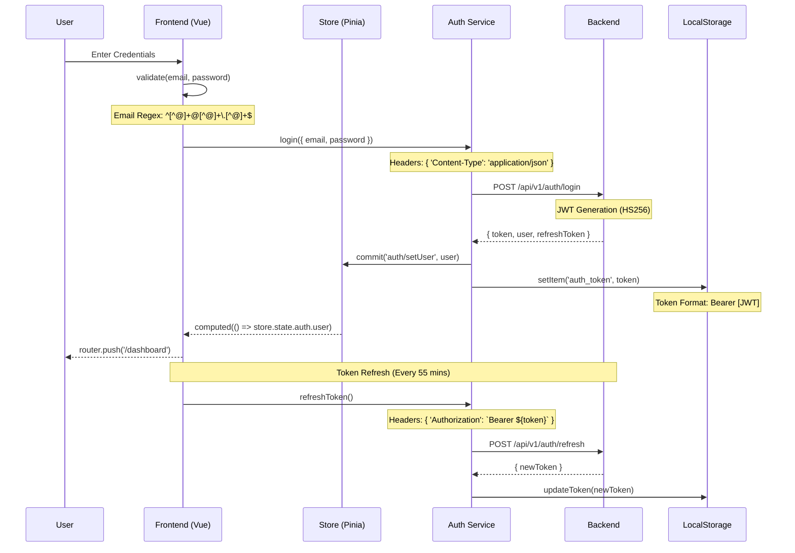
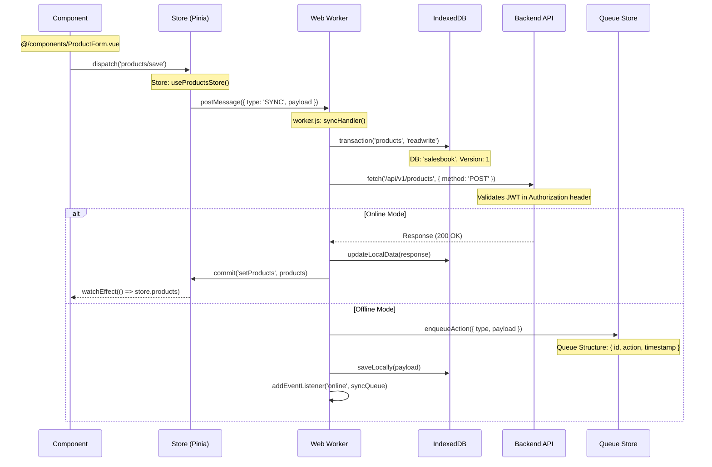
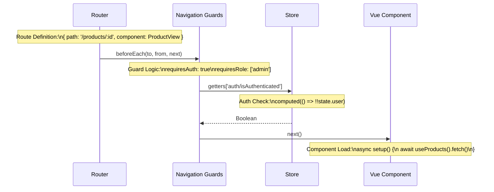
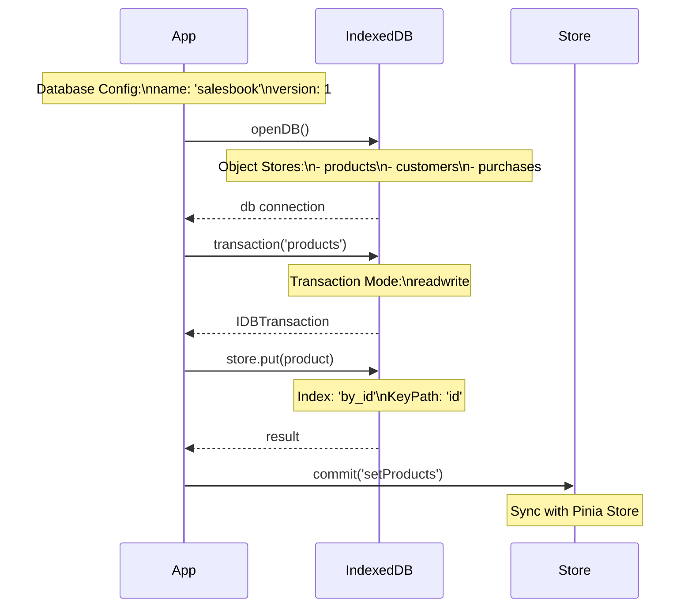

# Salesbook Frontend Flow Diagrams

## Technical Flow Details

### 1. Authentication Flow with Technical Details


### 2. Product Management Technical Flow
```mermaid
flowchart TD
    A[Start] --> B{Cache Check}
    B -->|Hit| C[useProductsStore().products]
    B -->|Miss| D[fetchProducts()]
    
    subgraph Cache Logic
    C --> E[computed(() => products)]
    end
    
    subgraph API Calls
    D --> F[GET /api/v1/products]
    F --> G{Response}
    G -->|200| H[commit('setProducts')]
    G -->|Error| I[handleError()]
    end
    
    subgraph Form Handling
    J[Product Form] --> K[v-model bindings]
    K --> L{Validation}
    L -->|Valid| M[submitForm()]
    L -->|Invalid| N[showErrors()]
    end
    
    subgraph API Integration
    M --> O[POST/PUT Product]
    O --> P[handleResponse()]
    P --> Q[updateStore()]
    end
    
    subgraph Error Handling
    I --> R[toast.error()]
    I --> S[logError()]
    end
    
    style Cache Logic fill:#f9f,stroke:#333
    style API Calls fill:#bbf,stroke:#333
    style Form Handling fill:#bfb,stroke:#333
    style API Integration fill:#fbb,stroke:#333
    style Error Handling fill:#fbf,stroke:#333
```

### 3. Data Synchronization Technical Flow


### 4. Form Technical Flow
```mermaid
stateDiagram-v2
    [*] --> FormIdle: mounted()
    note right of FormIdle: Component Setup\nrefs: () => reactive({})
    
    FormIdle --> FormEditing: v-model update
    note right of FormEditing: Validation Rules:\n- required\n- minLength\n- custom validators
    
    FormEditing --> FormValidating: handleSubmit()
    note right of FormValidating: Validation Service:\nvalidateForm(formData)
    
    FormValidating --> FormSubmitting: isValid
    note right of FormSubmitting: API Call:\nPOST/PUT with Axios
    
    FormSubmitting --> FormSuccess: response.status === 200
    note right of FormSuccess: Toast:\nshowSuccess(message)
    
    FormSubmitting --> FormError: catch(error)
    note right of FormError: Error Handler:\nhandleAxiosError(error)
```

### 5. Component Lifecycle Technical Flow
```mermaid
flowchart TD
    A[setup()] --> B[defineProps/Emits]
    B --> C[Reactive State]
    C --> D[Computed Props]
    D --> E[Watch Effects]
    
    subgraph Setup Phase
    B --> F[Props Interface]
    note right of F: interface Props { modelValue: string }
    C --> G[State Definition]
    note right of G: const state = reactive({ loading: false })
    D --> H[Computed Setup]
    note right of H: computed(() => props.modelValue)
    E --> I[Watch Setup]
    note right of I: watch(() => props.value, callback)
    end
    
    subgraph Lifecycle Hooks
    J[onMounted] --> K[Initial Data Fetch]
    note right of K: await store.dispatch('fetch')
    L[onUpdated] --> M[DOM Updates]
    note right of M: nextTick(() => { updateUI() })
    N[onUnmounted] --> O[Cleanup]
    note right of O: unsubscribe(), clearInterval()
    end
    
    style Setup Phase fill:#f9f,stroke:#333
    style Lifecycle Hooks fill:#bbf,stroke:#333
```

### 6. Store Technical Flow (Pinia)
```mermaid
flowchart LR
    A[Component] --> B[Action Dispatch]
    B --> C[Store Action]
    
    subgraph Store Definition
    D[State] --> E[Products Array]
    note right of E: state: () => ({ products: [] })
    F[Getters] --> G[Computed Values]
    note right of G: filtered: (state) => state.products.filter()
    H[Actions] --> I[Async Operations]
    note right of I: async fetchProducts({ commit })
    end
    
    subgraph API Integration
    J[API Call] --> K[Response Handler]
    note right of K: try/catch with axios instance
    L[Error Handler] --> M[State Update]
    note right of M: commit('setError', error)
    end
    
    style Store Definition fill:#f9f,stroke:#333
    style API Integration fill:#bbf,stroke:#333
```

### 7. Router Technical Flow


### 8. Error Handling Technical Flow
```mermaid
flowchart TD
    A[Error Occurs] --> B{Error Type}
    
    subgraph API Errors
    B -->|Axios Error| C[handleAxiosError]
    note right of C: switch(error.response.status)
    C --> D{Status Code}
    D -->|401| E[handleAuthError]
    note right of E: router.push('/login')
    D -->|403| F[handleForbidden]
    note right of F: toast.error('No permission')
    D -->|500| G[handleServerError]
    note right of G: logError(error)
    end
    
    subgraph Validation Errors
    B -->|Form Error| H[handleValidation]
    note right of H: errors = validateForm(data)
    H --> I[showFieldErrors]
    note right of I: form.setErrors(errors)
    end
    
    subgraph Network Errors
    B -->|Network| J[handleNetwork]
    note right of J: navigator.onLine check
    J --> K[enableOfflineMode]
    note right of K: store.commit('setOffline')
    end
    
    style API Errors fill:#f9f,stroke:#333
    style Validation Errors fill:#bbf,stroke:#333
    style Network Errors fill:#bfb,stroke:#333
```

### 9. IndexedDB Technical Flow


These technical flows include:
1. Specific implementation details
2. Code snippets and patterns
3. Configuration details
4. Data structures
5. API specifications
6. Error handling strategies
7. State management details
8. Database schemas


