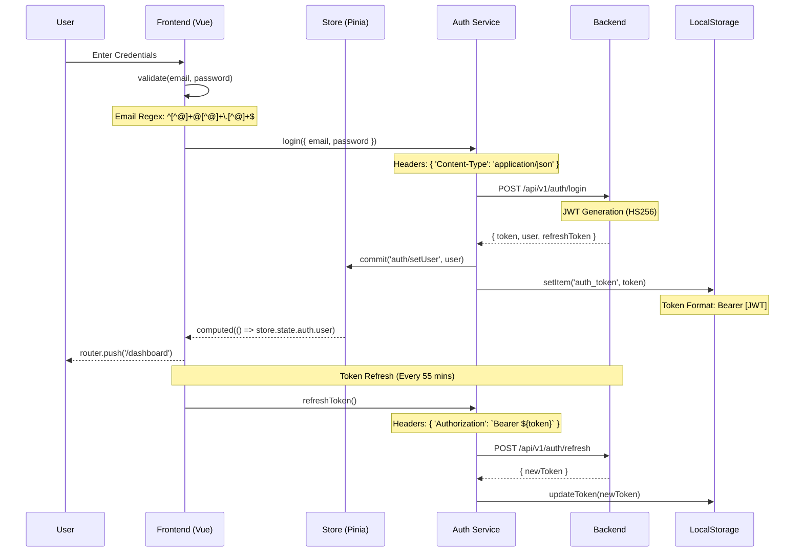
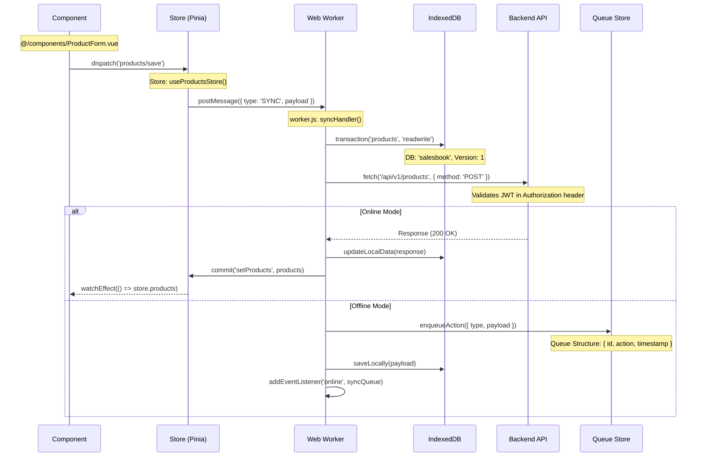
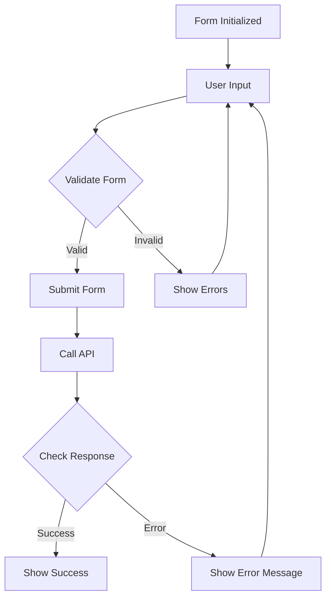
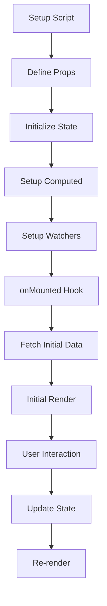
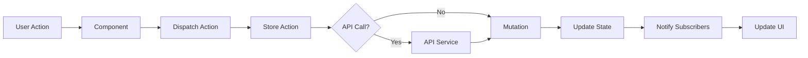
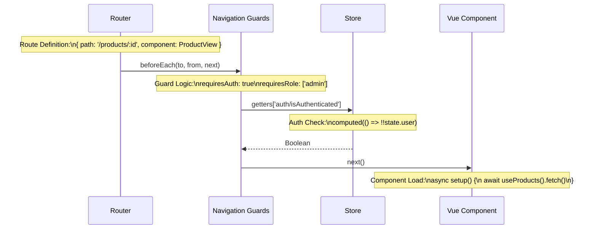
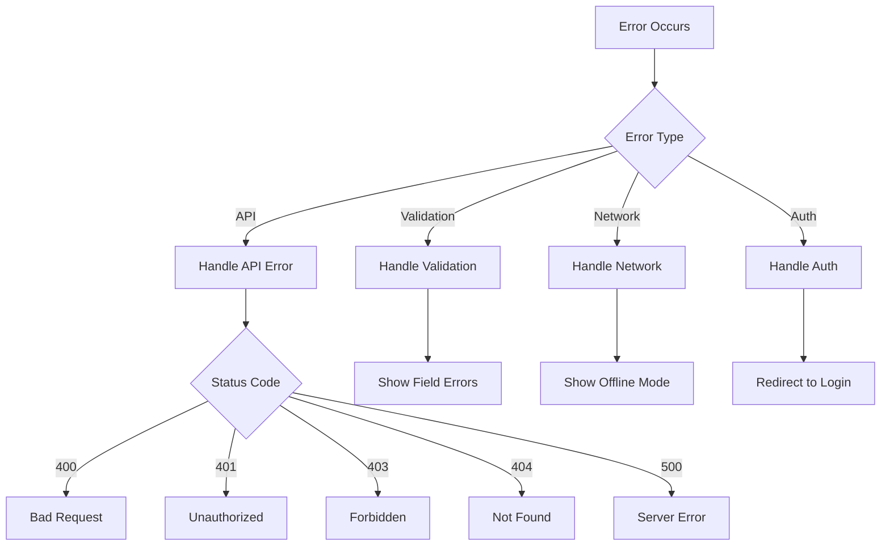
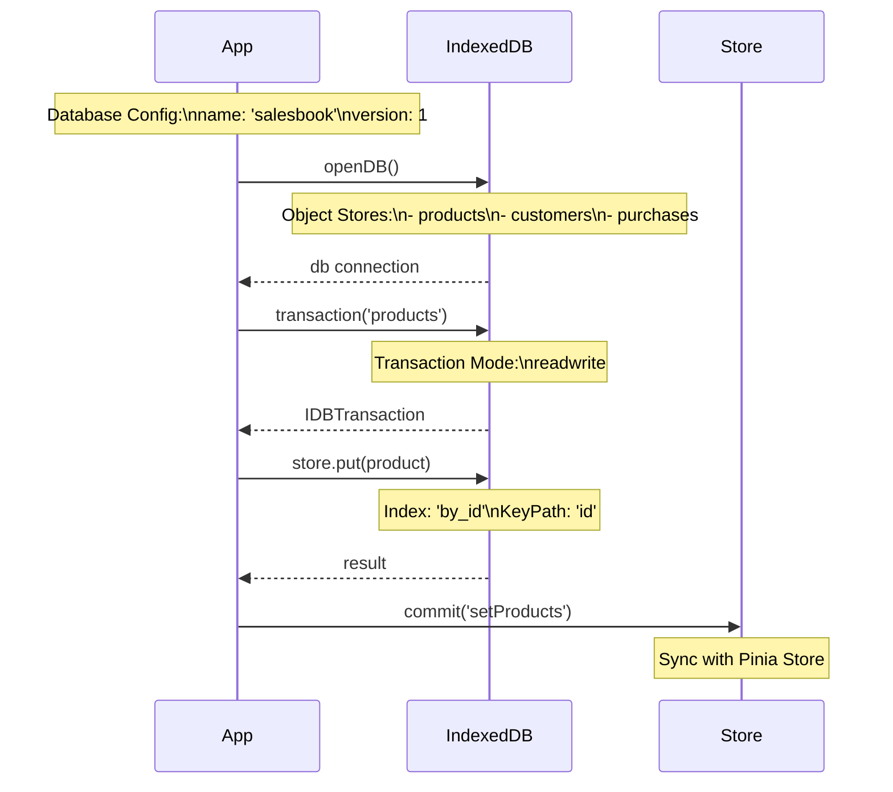

# Salesbook Frontend Flow Diagrams

## Technical Flow Details

### 1. Authentication Flow with Technical Details


### 2. Product Management Technical Flow
```mermaid
graph TD
    A[Start] --> B{Cache Check}
    B -->|Hit| C[useProductsStore().products]
    B -->|Miss| D[fetchProducts()]
    
    subgraph Cache Logic
    C --> E[computed(() => products)]
    end
    
    subgraph API Calls
    D --> F[GET /api/v1/products]
    F --> G{Response}
    G -->|200| H[commit('setProducts')]
    G -->|Error| I[handleError()]
    end
    
    subgraph Form Handling
    J[Product Form] --> K[v-model bindings]
    K --> L{Validation}
    L -->|Valid| M[submitForm()]
    L -->|Invalid| N[showErrors()]
    end
    
    subgraph API Integration
    M --> O[POST/PUT Product]
    O --> P[handleResponse()]
    P --> Q[updateStore()]
    end
    
    subgraph Error Handling
    I --> R[toast.error()]
    I --> S[logError()]
    end
    
    style Cache Logic fill:#f9f,stroke:#333
    style API Calls fill:#bbf,stroke:#333
    style Form Handling fill:#bfb,stroke:#333
    style API Integration fill:#fbb,stroke:#333
    style Error Handling fill:#fbf,stroke:#333
```

### 3. Data Synchronization Technical Flow


### 4. Form Technical Flow


### 5. Component Lifecycle Technical Flow


### 6. Store Technical Flow (Pinia)


### 7. Router Technical Flow


### 8. Error Handling Technical Flow


### 9. IndexedDB Technical Flow


These technical flows include:
1. Specific implementation details
2. Code snippets and patterns
3. Configuration details
4. Data structures
5. API specifications
6. Error handling strategies
7. State management details
8. Database schemas
