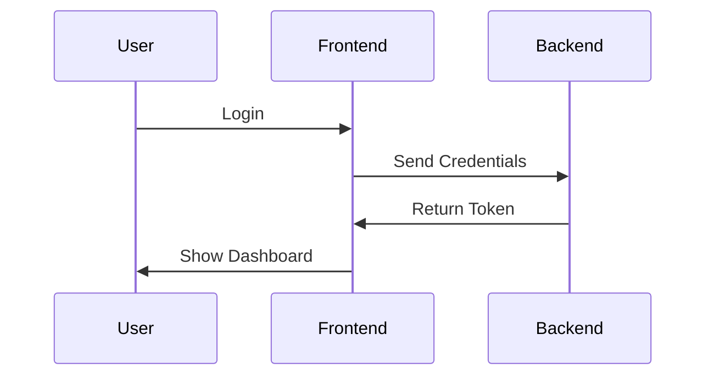
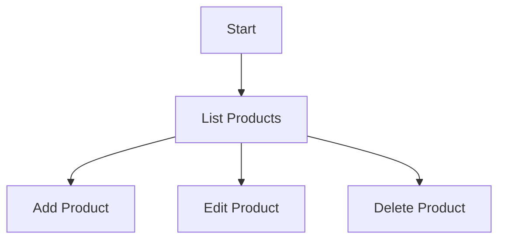
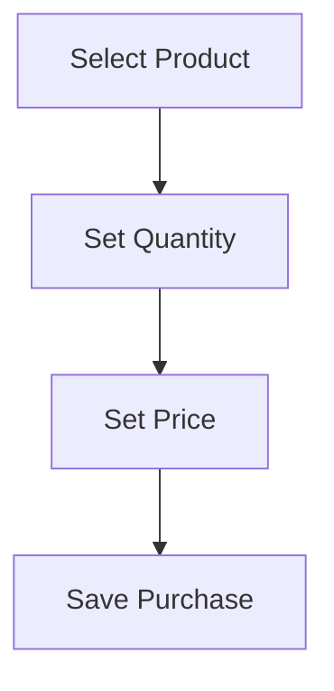
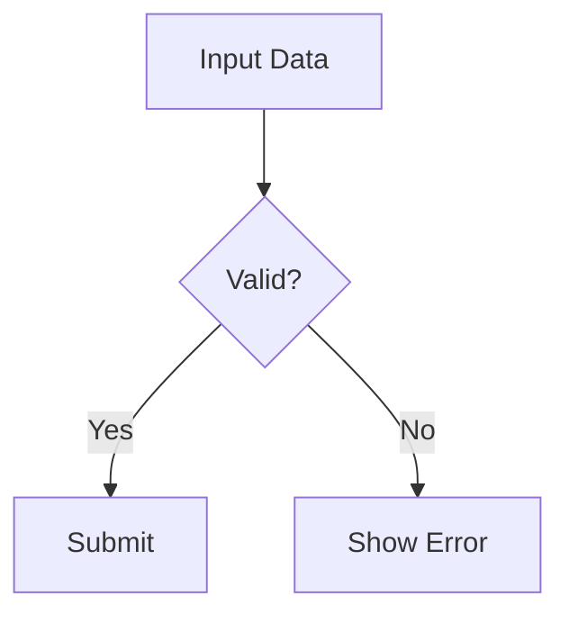
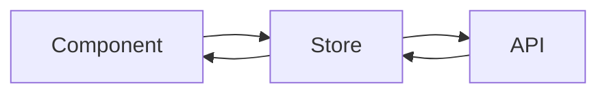
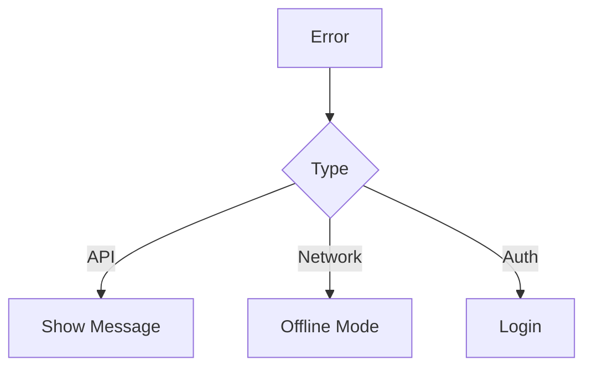
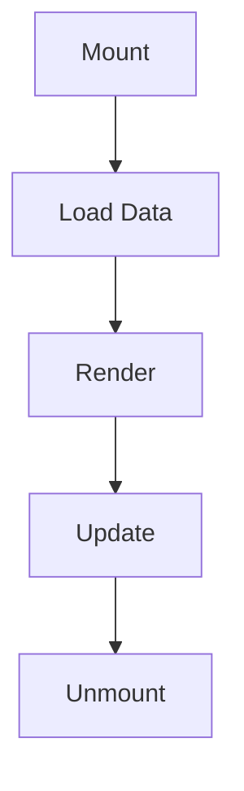
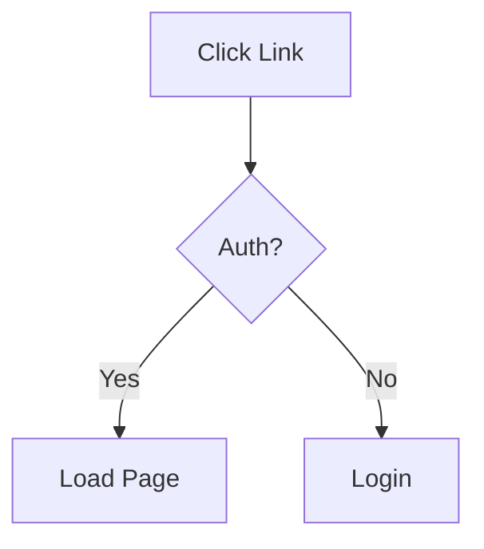
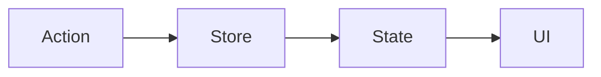

# Salesbook Frontend Flow Diagrams

## Core Application Flows

### 1. Basic Authentication Flow

### 2. Product Management Flow

### 3. Purchase Flow

### 4. Form Handling

### 5. Data Sync

### 6. Error Handling

### 7. Component Lifecycle

### 8. Navigation Flow

### 9. State Updates

These diagrams represent the core flows in the application. Each diagram is intentionally kept simple and focused on one specific aspect of the system.
